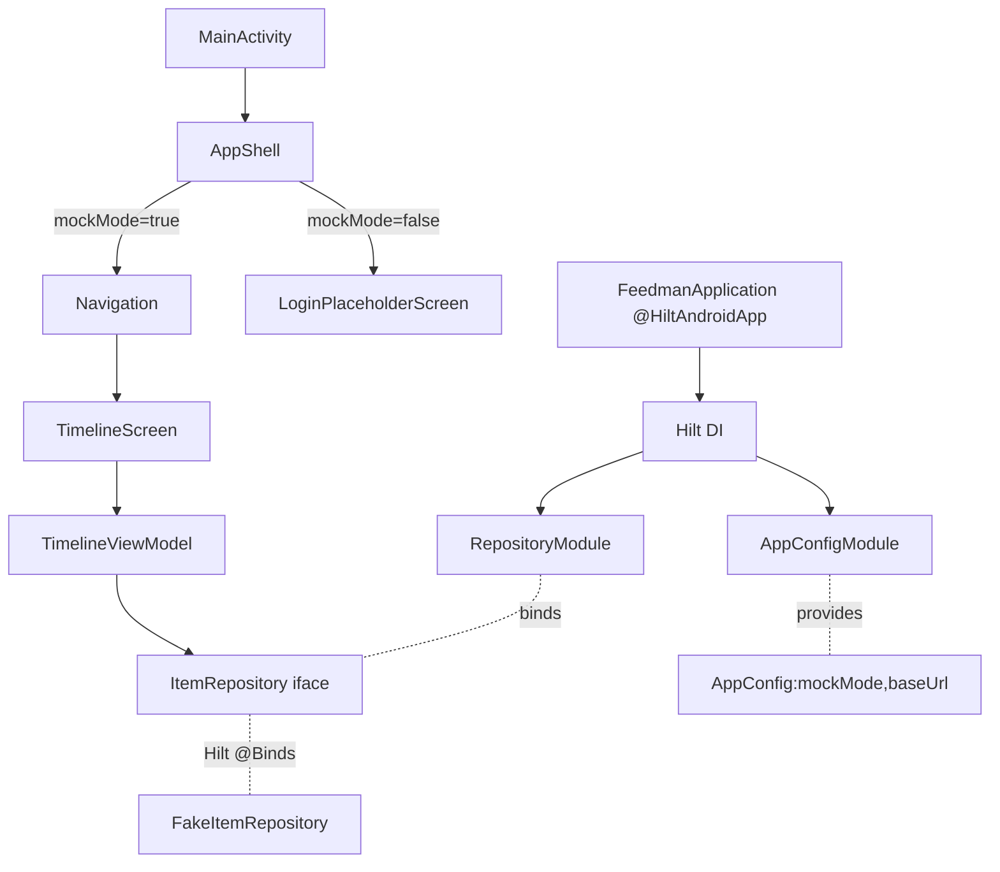

# Design Document

## Overview

**Purpose**: 本機能は **後続の機能 Issue が独立に進められる Android プロジェクト基盤**（Gradle 構成・パッケージ骨格・DI・モック起動経路）を **Android アプリ開発者** に提供する。

**Users**: idd-claude の Developer / 人間の開発者が、本スケルトンを起点に各 feature Issue（タイムライン / ログイン / 詳細シート等）を `feature/<name>/` に差し込む workflow で利用する。CI（後続 Issue #14）も `./gradlew build` を起点に組み立てる。

**Impact**: 現在 `feedman-android` リポジトリは設計ドキュメントのみで Android ソース・Gradle 設定を持たない状態である。本スケルトンの導入により、(a) `./gradlew build` が成功する単一 `:app` モジュール、(b) `docs/GRAND-DESIGN.md` §3 のパッケージ骨格、(c) Hilt + Fake Repository、(d) `feedman.mockMode=true` 時のドロワーシェル + モックタイムライン、が成立する。実 OAuth / 実 API / デザインシステム確定 / CI は本 Issue のスコープ外であり、抽象境界（`AuthRepository` / `ItemRepository` インターフェース）だけを置いて Fake にバインドする。

### Goals

- `./gradlew build` が clone 直後に exit code 0 で終了する（compile + lint + JVM unit test）
- `docs/GRAND-DESIGN.md` §3 のパッケージ骨格（`core/*` / `feature/*` / `shell` / `di`）を placeholder 込みで配置する
- Hilt 経由で `ItemRepository`（インターフェース）が `FakeItemRepository` にバインドされ、機能 Issue が差し替え可能な状態にする
- 認証なし起動でログイン placeholder 画面を表示し、`feedman.mockMode=true` 時はドロワーシェル + モックタイムラインを起動経路として表示する
- `feedman.baseUrl` / `feedman.mockMode` を `BuildConfig.BASE_URL` / `BuildConfig.MOCK_MODE` に反映する

### Non-Goals

- 実 Google OAuth フロー（`AuthRepository` の Fake 実装のみ）
- `feedman` サーバーの実 API 結合・Retrofit インターフェース（`core/network` は placeholder のみ）
- デザインシステムの確定（`FeedmanTheme` は最小の Material3 デフォルト + accent Indigo のみ）
- CI（GitHub Actions）整備（Issue #14）
- ItemStateStore の楽観的更新ロジック・Paging 3 共通 PagingSource 基盤（後続 Issue）
- `feature/*` 各画面の本実装（ログイン placeholder と timeline 最小実装のみ）
- リリース署名鍵 / `google-services.json` / Firebase 設定

## Architecture

### Existing Architecture Analysis

- リポジトリにはまだ Kotlin / Gradle 資産が存在しない（greenfield）。設計ドキュメント (`docs/GRAND-DESIGN.md` / `design/SPEC.md`) のみが正本として存在する
- 維持すべき制約:
  - **単一 `:app` Gradle モジュール + パッケージ分割**（GRAND-DESIGN §1）— マルチモジュール化しない
  - **MVVM + Repository、単方向データフロー**（SPEC §2）
  - **依存方向**: `feature/* → core/*`、`shell → feature/*, core/*`、`core/*` から `feature/*` への参照は禁止、`feature/*` 同士の直接参照も禁止
  - **`com.feedman.android` 名前空間 / min SDK 26 / JDK 17**
- 解消すべき technical debt: なし（greenfield）

### Architecture Pattern & Boundary Map



**Architecture Integration**:
- 採用パターン: **MVVM + Repository（GRAND-DESIGN §1 確定）**。本 Issue では Timeline のみ最小実装する
- ドメイン／機能境界: `feature/timeline` は `core/data.ItemRepository` インターフェースだけに依存し、Fake かどうかを意識しない。起動経路（mock vs login placeholder）の判定は `shell.AppShell` で `AppConfig.mockMode` を参照して分岐する
- 既存パターンの維持: GRAND-DESIGN §3 のパッケージ命名・依存方向、§4 のレイヤー責務（Composable は stateless、ViewModel が `StateFlow<UiState>` を公開、Repository は suspend / Flow）
- 新規コンポーネントの根拠:
  - `AppConfig`（`core/model`）: `BuildConfig.MOCK_MODE` / `BuildConfig.BASE_URL` を Hilt 経由で injectable にする値オブジェクト。`BuildConfig` を直接参照すると Composable / ViewModel のテスト容易性が落ちるため挟む
  - `LoginPlaceholderScreen`（`feature/login`）: Issue 1 専用の placeholder。後続の本実装 Issue で本物の `LoginScreen` に置換される

### Technology Stack

| Layer | Choice / Version | Role in Feature | Notes |
|-------|------------------|-----------------|-------|
| Frontend / CLI | Jetpack Compose（Compose BOM 最新安定版） + Material 3 | UI 全体 | placeholder Screen と TimelineScreen を実装 |
| Backend / Services | （なし） | — | 本 Issue では実 API に触らない |
| Data / Storage | （なし） | — | Fake Repository のみ。EncryptedSharedPreferences 等は後続 Issue |
| Messaging / Events | Kotlin Coroutines + Flow（最新安定版） | ViewModel StateFlow / Fake Repository の `flow {}` | Paging 3 は本 Issue では依存に含めるが利用しない |
| Infrastructure / Runtime | Kotlin（最新安定版） / AGP（最新安定版） / Gradle wrapper（最新安定版）/ JDK 17 / min SDK 26 / compileSdk 35 | ビルド基盤 | compileSdk 35 を上限とする（ローカル環境制約） |
| DI | Hilt（最新安定版） | Repository バインド / AppConfig 供給 | `di` パッケージに module 集約 |
| Test | JUnit4 + kotlinx-coroutines-test + Turbine（最新安定版） | JVM 単体テスト | MockWebServer は本 Issue では未使用 |
| Lint / Format | Android Lint（AGP 同梱） | `./gradlew lint` を build に組み込む | ktlint は本 Issue で必須化しない（後続 Issue で検討） |

> 個別の依存バージョンは `gradle/libs.versions.toml` で宣言する。NFR 1.1 / 1.2 に従い、各依存の最新安定版（GA）を採用し、alpha / beta / RC を既定にしない。安定版が無いやむを得ない場合は Version Catalog コメントに理由を残す。

## File Structure Plan

### Directory Structure

```
feedman-android/
├── README.md                                   # 既存。ビルド手順節を追記（Req 6.1, 6.2）
├── settings.gradle.kts                         # 新規: ルート設定 / pluginManagement / dependencyResolutionManagement
├── build.gradle.kts                            # 新規: トップレベル build script（plugins ブロックのみ）
├── gradle.properties                           # 新規: org.gradle.jvmargs / android.useAndroidX 等
├── gradlew, gradlew.bat                        # 新規: Gradle wrapper スクリプト
├── gradle/
│   ├── wrapper/
│   │   ├── gradle-wrapper.jar                  # 新規: wrapper jar
│   │   └── gradle-wrapper.properties           # 新規: distributionUrl 固定（NFR 3.1）
│   └── libs.versions.toml                      # 新規: Version Catalog（NFR 1.1）
├── .gitignore                                  # 新規: build/, .idea/, local.properties 等
└── app/
    ├── build.gradle.kts                        # 新規: android {} / kotlinOptions / buildConfigField / Gradle プロパティ→BuildConfig マッピング
    ├── proguard-rules.pro                      # 新規: 空テンプレート（release 用、本 Issue では未使用）
    └── src/
        ├── main/
        │   ├── AndroidManifest.xml             # 新規: FeedmanApplication / MainActivity 宣言、INTERNET 権限
        │   ├── res/
        │   │   ├── values/strings.xml          # 新規: app_name 等の最小文字列
        │   │   ├── values/themes.xml           # 新規: Theme.Feedman（Material3 親）
        │   │   ├── mipmap-*/ic_launcher.*      # 新規: AGP 既定のランチャーアイコン
        │   │   └── xml/                        # 新規: 必要に応じて backup_rules 等（最小）
        │   └── kotlin/com/feedman/android/
        │       ├── FeedmanApplication.kt       # 新規: @HiltAndroidApp（Req 2.5）
        │       ├── MainActivity.kt             # 新規: single-activity / AppShell を setContent（Req 2.5）
        │       ├── core/
        │       │   ├── model/
        │       │   │   ├── AppConfig.kt        # 新規: data class AppConfig(baseUrl, mockMode)
        │       │   │   ├── Item.kt             # 新規: placeholder（ItemSummary 最小定義）
        │       │   │   └── package-info.kt     # 新規: KDoc placeholder（空ディレクトリ回避 Req 2.7）
        │       │   ├── network/
        │       │   │   └── package-info.kt     # 新規: KDoc placeholder（Req 2.7）
        │       │   ├── auth/
        │       │   │   ├── AuthRepository.kt   # 新規: interface placeholder（後続 Issue で本実装）
        │       │   │   └── package-info.kt     # 新規: KDoc placeholder
        │       │   ├── data/
        │       │   │   ├── ItemRepository.kt   # 新規: interface ItemRepository（Req 3.2）
        │       │   │   └── fake/
        │       │   │       └── FakeItemRepository.kt   # 新規: Fake 実装（Req 3.2）
        │       │   ├── designsystem/
        │       │   │   ├── FeedmanTheme.kt     # 新規: Material3 MaterialTheme ラッパ（最小）
        │       │   │   └── FeedmanColors.kt    # 新規: placeholder（最小 ColorScheme）
        │       │   └── ui/
        │       │       └── package-info.kt     # 新規: KDoc placeholder（Req 2.7）
        │       ├── feature/
        │       │   ├── login/
        │       │   │   └── LoginPlaceholderScreen.kt   # 新規: ログイン placeholder Composable（Req 4.1）
        │       │   ├── timeline/
        │       │   │   ├── TimelineScreen.kt           # 新規: モックタイムライン Composable（Req 4.4）
        │       │   │   └── TimelineViewModel.kt        # 新規: @HiltViewModel / StateFlow<TimelineUiState>
        │       │   ├── feed/                  # placeholder（package-info.kt のみ）
        │       │   ├── articledetail/         # placeholder
        │       │   ├── starred/               # placeholder
        │       │   ├── search/                # placeholder
        │       │   ├── registerfeed/          # placeholder
        │       │   ├── subscriptionsettings/  # placeholder
        │       │   └── account/               # placeholder（各 feature と同じく package-info.kt）
        │       ├── shell/
        │       │   ├── AppShell.kt             # 新規: 起動経路分岐（mockMode で Navigation / そうでなければ LoginPlaceholderScreen）
        │       │   ├── DrawerContent.kt        # 新規: 最小ドロワー（タイムライン項目のみ）
        │       │   └── Navigation.kt           # 新規: NavHost。timeline ルートのみ
        │       └── di/
        │           ├── RepositoryModule.kt     # 新規: @Binds ItemRepository → FakeItemRepository（Req 3.1, 3.3）
        │           └── AppConfigModule.kt      # 新規: @Provides AppConfig from BuildConfig（Req 5.1, 5.2）
        └── test/
            └── kotlin/com/feedman/android/
                ├── core/data/fake/
                │   └── FakeItemRepositoryTest.kt   # 新規: JVM 単体テスト（Req 1.6, NFR 2.1）
                └── feature/timeline/
                    └── TimelineViewModelTest.kt    # 新規: JVM 単体テスト（任意、追加テスト）
```

**注意点**:
- `feature/feed/` 〜 `feature/account/` の **7 個の placeholder package** は `package-info.kt`（または `Placeholder.kt` でも可。Kotlin では package-info の代わりに空 file-level KDoc を持つ Kotlin file を 1 個置く運用）で空ディレクトリを回避する（Req 2.7）
- `core/model/Item.kt` は後続 Issue（SPEC §4 の `CrossFeedItem` / `ItemSummary` 等）で本実装される。本 Issue では `FakeItemRepository` がモック記事を返すための最小 `data class ItemSummary` のみ置く
- `app/src/androidTest/` は **本 Issue ではディレクトリのみ作成し、`.gitkeep` で保持**（NFR 2.2）。テストファイルは置かない

### Modified Files
- `README.md` — 既存ファイルに「ビルド手順」「`feedman.baseUrl` / `feedman.mockMode` の指定方法」「モックモード起動方法」の節を追加（Req 6.1, 6.2）

## Requirements Traceability

| Requirement | Summary | Components / Files | Flows / Notes |
|-------------|---------|--------------------|---------------|
| 1.1 | `./gradlew build` 成功 | `build.gradle.kts` / `app/build.gradle.kts` / `gradle/libs.versions.toml` / `FakeItemRepositoryTest` | build = compile + lint + test |
| 1.2 | min SDK 26 / namespace `com.feedman.android` | `app/build.gradle.kts` の `defaultConfig.minSdk = 26`, `namespace = "com.feedman.android"`, `applicationId = "com.feedman.android"` | — |
| 1.3 | JDK 17 toolchain + Compose Material 3 | `app/build.gradle.kts` の `kotlin { jvmToolchain(17) }` + Compose BOM + `material3` 依存 | — |
| 1.4 | Kotlin DSL + Version Catalog | `settings.gradle.kts` / `build.gradle.kts` / `app/build.gradle.kts` / `gradle/libs.versions.toml` | — |
| 1.5 | Gradle wrapper コミット | `gradlew` / `gradlew.bat` / `gradle/wrapper/*` | — |
| 1.6 | JVM 単体テスト 1 件以上 | `app/src/test/.../FakeItemRepositoryTest.kt` | `./gradlew build` で実行される |
| 1.7 | 最新安定版・alpha/beta 不採用 | `gradle/libs.versions.toml`（コメントで方針明記） | NFR 1.1, 1.2 と整合 |
| 2.1 | パッケージルート | `app/src/main/kotlin/com/feedman/android/` | — |
| 2.2 | `core/*` サブパッケージ 6 個 | File Structure Plan の `core/{model,network,auth,data,designsystem,ui}` | placeholder 込み |
| 2.3 | `feature/*` サブパッケージ 9 個 | File Structure Plan の `feature/{login,timeline,feed,articledetail,starred,search,registerfeed,subscriptionsettings,account}` | — |
| 2.4 | `shell` / `di` パッケージ | `shell/{AppShell,DrawerContent,Navigation}.kt` / `di/{RepositoryModule,AppConfigModule}.kt` | — |
| 2.5 | `FeedmanApplication` / `MainActivity` | `FeedmanApplication.kt`（@HiltAndroidApp） / `MainActivity.kt`（@AndroidEntryPoint, single-activity） | AndroidManifest に登録 |
| 2.6 | 依存方向遵守 | `feature/timeline` は `core/data.ItemRepository` のみ参照。`core/*` は `feature/*` を import しない | レビュー観点で目視 + Lint は後続 Issue で導入検討 |
| 2.7 | placeholder で空ディレクトリ回避 | 各 placeholder package に `package-info.kt`（KDoc 付き Kotlin file） | — |
| 3.1 | Hilt 組込 + module 集約 | `FeedmanApplication`（@HiltAndroidApp） + `di/{RepositoryModule,AppConfigModule}.kt` | — |
| 3.2 | `ItemRepository` インターフェース + Fake | `core/data/ItemRepository.kt` / `core/data/fake/FakeItemRepository.kt` | — |
| 3.3 | Fake をデフォルトバインド | `di/RepositoryModule.kt` の `@Binds` | — |
| 3.4 | 手動シングルトン禁止 | Hilt `@Singleton` スコープで FakeItemRepository を保持 | — |
| 4.1 | 起動時ログイン placeholder | `AppShell` が `AppConfig.mockMode == false` で `LoginPlaceholderScreen` を表示 | — |
| 4.2 | 実 OAuth 呼び出し禁止 | `LoginPlaceholderScreen` は静的 Composable のみ、`AuthRepository` の Fake すら呼ばない | — |
| 4.3 | `mockMode=true` でドロワーシェル + モックタイムライン | `AppShell` が `AppConfig.mockMode == true` で `ModalNavigationDrawer + Navigation(timeline)` を表示 | — |
| 4.4 | モックタイムラインに Fake 記事 | `TimelineViewModel` が `ItemRepository`（= Fake）から記事を取得 | StateFlow で Composable へ |
| 4.5 | `mockMode` 未指定/false で placeholder | `AppConfigModule` の既定値 false → `AppShell` で placeholder へ | Req 5.4 と整合 |
| 5.1 | `feedman.baseUrl` → `BuildConfig.BASE_URL` | `app/build.gradle.kts` の `buildConfigField("String", "BASE_URL", ...)` | — |
| 5.2 | `feedman.mockMode` → `BuildConfig.MOCK_MODE` | `app/build.gradle.kts` の `buildConfigField("boolean", "MOCK_MODE", ...)` | — |
| 5.3 | `feedman.baseUrl` 未指定で開発サーバー既定 | `app/build.gradle.kts` の `findProperty("feedman.baseUrl") ?: "<開発サーバー URL>"` | 既定値はコメントで明示 |
| 5.4 | `feedman.mockMode` 未指定で false | `app/build.gradle.kts` の `findProperty("feedman.mockMode")?.toString()?.toBoolean() ?: false` | — |
| 5.5 | 機密値の埋め込み禁止 | Version Catalog / source コードに API key 等を書かない | レビュー観点 |
| 6.1 | README にビルド手順 | `README.md`「ビルド手順」節 | — |
| 6.2 | README にプロパティ指定方法 | `README.md` 同節 | — |
| NFR 1.1 | 主要依存の安定版宣言 | `gradle/libs.versions.toml` | — |
| NFR 1.2 | 例外時の理由明記 | Version Catalog コメント | — |
| NFR 2.1 | `app/src/test/` 有効化 | `app/build.gradle.kts`（testOptions） + `FakeItemRepositoryTest` | — |
| NFR 2.2 | `app/src/androidTest/` 有効化（CI 必須化はしない） | `app/src/androidTest/.gitkeep` でディレクトリ保持 | — |
| NFR 3.1 | Gradle wrapper の固定 | `gradle/wrapper/gradle-wrapper.properties` の `distributionUrl` 固定 | — |

## Components and Interfaces

### Build / Gradle Layer

#### GradleBuildConfig（`app/build.gradle.kts`）

| Field | Detail |
|-------|--------|
| Intent | Android アプリのビルド設定と Gradle プロパティ → BuildConfig マッピングを定義する |
| Requirements | 1.2, 1.3, 1.4, 5.1, 5.2, 5.3, 5.4, NFR 2.1, NFR 2.2 |

**Responsibilities & Constraints**
- `applicationId = "com.feedman.android"` / `namespace = "com.feedman.android"` / `minSdk = 26` / `compileSdk = 35` / `targetSdk = 35`
- Kotlin JVM toolchain 17、Compose 有効化（`buildFeatures { compose = true; buildConfig = true }`）
- `feedman.baseUrl` / `feedman.mockMode` を `findProperty` で読み、`buildConfigField` で `BASE_URL` / `MOCK_MODE` に注入
- `testOptions.unitTests.isReturnDefaultValues = true` を必要に応じ設定

**Dependencies**
- Inbound: Gradle CLI（`./gradlew build`） — ビルド entry (Critical)
- Outbound: `gradle/libs.versions.toml` — 依存バージョン参照 (Critical)
- External: AGP / Kotlin / Hilt / Compose BOM — (Critical)

**Contracts**: Service [ ] / API [ ] / Event [ ] / Batch [x] / State [ ]

##### Batch Contract（Gradle プロパティ → BuildConfig）

| Gradle Property | BuildConfig Field | Default (未指定時) | 型 |
|-----------------|-------------------|--------------------|----|
| `feedman.baseUrl` | `BASE_URL` | `"https://dev.feedman.example.com"`（開発サーバー既定。Issue 確定値があれば差し替え） | `String` |
| `feedman.mockMode` | `MOCK_MODE` | `false` | `boolean` |

- 既定値は `app/build.gradle.kts` のコメントで根拠（Req 5.3 / 5.4）を明示する
- Gradle プロパティの渡し方: `./gradlew build -Pfeedman.mockMode=true` または `gradle.properties` に `feedman.mockMode=true` を記述

#### VersionCatalog（`gradle/libs.versions.toml`）

| Field | Detail |
|-------|--------|
| Intent | 主要依存のバージョンを集中宣言し、安定版方針を enforce する |
| Requirements | 1.4, 1.7, NFR 1.1, NFR 1.2 |

**Responsibilities & Constraints**
- `[versions]` に Kotlin / AGP / Compose BOM / Hilt / Coroutines / Retrofit / OkHttp / kotlinx.serialization / Coil / Paging / Material3 / JUnit / Turbine を列挙
- 各 version は **GA 安定版**を採用。alpha / beta / RC は既定で宣言しない（Req 1.7）
- やむを得ず安定版がない場合は TOML コメントで理由明記（NFR 1.2）
- 機密値は記述しない（Req 5.5）

### Application Layer

#### FeedmanApplication

| Field | Detail |
|-------|--------|
| Intent | Hilt 起動点となる Application クラス |
| Requirements | 2.5, 3.1 |

**Responsibilities & Constraints**
- `@HiltAndroidApp` を付与
- アプリ全体のシングルトン保持は Hilt に委譲（手動シングルトン禁止 / Req 3.4）

**Dependencies**: Hilt runtime (Critical)
**Contracts**: 該当なし（Application lifecycle のみ）

#### MainActivity

| Field | Detail |
|-------|--------|
| Intent | single-activity 構成の唯一の Activity。`AppShell` を `setContent` でホストする |
| Requirements | 2.5, 4.1, 4.3 |

**Responsibilities & Constraints**
- `@AndroidEntryPoint`
- `setContent { FeedmanTheme { AppShell() } }`
- ディープリンク受領は本 Issue では未実装（後続 Issue で intent-filter を追加）

### Shell Layer

#### AppShell

| Field | Detail |
|-------|--------|
| Intent | 起動経路を `AppConfig.mockMode` で分岐し、ログイン placeholder またはドロワー + Navigation を表示する |
| Requirements | 4.1, 4.3, 4.5 |

**Responsibilities & Constraints**
- `AppConfig` を Hilt 経由で取得（`hiltViewModel()` か直接 inject）
- `mockMode == true` のとき `ModalNavigationDrawer(drawerContent = { DrawerContent() }) { Navigation() }`
- `mockMode == false` のとき `LoginPlaceholderScreen()` を直接表示
- `SessionState` のロジックは持たない（後続 Issue で導入）

**Dependencies**
- Inbound: `MainActivity` (Critical)
- Outbound: `feature/login.LoginPlaceholderScreen` / `shell.Navigation` / `core/model.AppConfig` (Critical)

**Contracts**: State [x]

##### State Contract（起動経路）

| AppConfig.mockMode | 表示するルート Composable |
|--------------------|--------------------------|
| `false` | `LoginPlaceholderScreen`（Req 4.1, 4.5） |
| `true` | `ModalNavigationDrawer + Navigation(start = "timeline")`（Req 4.3） |

#### DrawerContent

| Field | Detail |
|-------|--------|
| Intent | 最小ドロワー UI（タイムライン項目のみ）。GRAND-DESIGN §3 の `DrawerContent.kt` 配置を満たす placeholder |
| Requirements | 2.4, 4.3 |

#### Navigation

| Field | Detail |
|-------|--------|
| Intent | `androidx.navigation:navigation-compose` の NavHost。本 Issue では `timeline` ルートのみ |
| Requirements | 2.4, 4.3, 4.4 |

### Core / Model

#### AppConfig（`core/model/AppConfig.kt`）

| Field | Detail |
|-------|--------|
| Intent | `BuildConfig.BASE_URL` / `BuildConfig.MOCK_MODE` をテスト容易な値オブジェクトに包む |
| Requirements | 5.1, 5.2 |

```kotlin
data class AppConfig(
    val baseUrl: String,
    val mockMode: Boolean,
)
```

#### Item（`core/model/Item.kt`）

| Field | Detail |
|-------|--------|
| Intent | Fake / Timeline が利用する最小の記事モデル placeholder |
| Requirements | 2.2, 4.4 |

```kotlin
data class ItemSummary(
    val id: String,
    val title: String,
    val feedName: String,
    val publishedAt: String,
)
```

- 本 Issue では SPEC §4.2 の本物の `CrossFeedItem` / `ItemSummary` は実装しない（後続 Issue）

### Core / Data

#### ItemRepository（interface）

| Field | Detail |
|-------|--------|
| Intent | 記事一覧取得の抽象境界。Fake / 実装の差し替え点 |
| Requirements | 3.2, 3.3, 4.4 |

```kotlin
interface ItemRepository {
    fun observeTimeline(): Flow<List<ItemSummary>>
}
```

- Preconditions: なし
- Postconditions: 返却 Flow は購読中の限り emit を継続する
- Invariants: 同一インスタンスから複数 subscriber が購読可能

#### FakeItemRepository

| Field | Detail |
|-------|--------|
| Intent | モックモード起動時の記事一覧を即座に emit する Fake 実装 |
| Requirements | 3.2, 3.3, 4.4 |

**Responsibilities & Constraints**
- 静的なモック記事リストを `flowOf(...)` で返す
- 副作用なし（テスト容易）

### Core / Auth（placeholder）

#### AuthRepository（interface）

| Field | Detail |
|-------|--------|
| Intent | 後続 Issue（Google OAuth）で本実装される認証境界。本 Issue は **インターフェース宣言のみ** |
| Requirements | 2.2, 4.2 |

- 本 Issue では Fake 実装も Hilt バインドも作らない（Req 4.2: 実 OAuth を呼び出さない、placeholder は静的）
- インターフェースだけ置くことで GRAND-DESIGN §3 のパッケージ骨格を満たす

### Core / Designsystem（最小）

#### FeedmanTheme

| Field | Detail |
|-------|--------|
| Intent | Material3 `MaterialTheme` の最小ラッパ。後続 Issue で oklch トークンを反映 |
| Requirements | 1.3, 2.2 |

#### FeedmanColors

| Field | Detail |
|-------|--------|
| Intent | 最小の lightColorScheme / darkColorScheme placeholder |
| Requirements | 2.2 |

### Feature / Login（placeholder）

#### LoginPlaceholderScreen

| Field | Detail |
|-------|--------|
| Intent | 認証なし起動時に表示する静的 Composable。実 OAuth を呼ばない |
| Requirements | 4.1, 4.2 |

**Responsibilities & Constraints**
- 「ログイン（後続 Issue で実装予定）」のような静的文言と無効化されたボタン
- `AuthRepository` を inject しない（呼び出すと placeholder の意図に反する）

### Feature / Timeline（最小実装）

#### TimelineViewModel

| Field | Detail |
|-------|--------|
| Intent | `ItemRepository` から取得した記事を `StateFlow<TimelineUiState>` で公開する |
| Requirements | 4.4 |

```kotlin
@HiltViewModel
class TimelineViewModel @Inject constructor(
    repo: ItemRepository,
) : ViewModel() {
    val uiState: StateFlow<TimelineUiState> = repo.observeTimeline()
        .map { TimelineUiState(items = it) }
        .stateIn(viewModelScope, SharingStarted.WhileSubscribed(5_000), TimelineUiState())
}

data class TimelineUiState(val items: List<ItemSummary> = emptyList())
```

#### TimelineScreen

| Field | Detail |
|-------|--------|
| Intent | `TimelineUiState` を受け取って Compose で記事一覧を描画する stateless Composable |
| Requirements | 4.3, 4.4 |

### DI Layer

#### RepositoryModule

| Field | Detail |
|-------|--------|
| Intent | `ItemRepository` を `FakeItemRepository` にバインド |
| Requirements | 3.1, 3.3, 3.4 |

```kotlin
@Module
@InstallIn(SingletonComponent::class)
abstract class RepositoryModule {
    @Binds
    @Singleton
    abstract fun bindItemRepository(impl: FakeItemRepository): ItemRepository
}
```

#### AppConfigModule

| Field | Detail |
|-------|--------|
| Intent | `BuildConfig.BASE_URL` / `BuildConfig.MOCK_MODE` を `AppConfig` として提供 |
| Requirements | 5.1, 5.2 |

```kotlin
@Module
@InstallIn(SingletonComponent::class)
object AppConfigModule {
    @Provides
    @Singleton
    fun provideAppConfig(): AppConfig = AppConfig(
        baseUrl = BuildConfig.BASE_URL,
        mockMode = BuildConfig.MOCK_MODE,
    )
}
```

## Data Models

### Domain Model（本 Issue 範囲）

- **AppConfig**: 値オブジェクト（`baseUrl: String`, `mockMode: Boolean`）。トランザクション境界なし
- **ItemSummary**: 記事の最小スナップショット（`id`, `title`, `feedName`, `publishedAt`）。本 Issue では Fake が生成する固定データ。後続 Issue で SPEC §4.2 の本物のモデルに差し替え

### Physical Data Model

本 Issue では永続化を行わない（EncryptedSharedPreferences / DataStore は後続 Issue）。

## Error Handling

### Error Strategy

本 Issue はビルド基盤と placeholder UI に閉じるため、ランタイムエラーパスは最小:

- **ビルドエラー**: Gradle が exit code != 0 で失敗 → 開発者がローカルで修正
- **placeholder UI エラー**: Fake Repository は失敗しない（静的データ）。例外を投げない設計

### Error Categories and Responses

- **User Errors (4xx)**: 該当なし（UI 入力なし）
- **System Errors (5xx)**: 該当なし（実 API なし）
- **Business Logic Errors**: 該当なし

> 本格的なエラー戦略（`FeedmanException` / 401 リフレッシュ / 楽観的更新ロールバック）は GRAND-DESIGN §5.1 / §5.3 / §5.4 に従い後続 Issue で導入する。

## Testing Strategy

- **Unit Tests**:
  - `FakeItemRepositoryTest`: `observeTimeline()` が 1 件以上の `ItemSummary` を emit することを Turbine で検証（Req 1.6, 3.2, 4.4）
  - `TimelineViewModelTest`: ViewModel が Fake から受け取った記事を `TimelineUiState.items` として公開することを `runTest` で検証（任意）
  - `AppConfigModuleTest`（任意）: `AppConfig` が `BuildConfig` 値を保持することの sanity check
- **Integration Tests**: 本 Issue では対象外（実 API なし）
- **E2E/UI Tests**: 本 Issue では対象外。`app/src/androidTest/` ディレクトリのみ確保（NFR 2.2）
- **Performance/Load**: 該当なし

## Security Considerations

- 本 Issue では機密情報を扱わない（Req 5.5）
- `BuildConfig.BASE_URL` の既定値は開発サーバー URL（公開可能）。実トークン・本番認証情報は Version Catalog / source に埋め込まない
- 後続 Issue で EncryptedSharedPreferences + Keystore（GRAND-DESIGN §5.3）を導入する際の境界として `core/auth` パッケージを今 Issue で確保する

## Migration Strategy

本 Issue は greenfield のため migration は不要。後続 Issue で `LoginPlaceholderScreen` → 本実装の `LoginScreen`、`FakeItemRepository` → 本実装 `DefaultItemRepository` への差し替えが発生するが、`ItemRepository` インターフェースを変更しない限り Hilt バインドの 1 行差し替えで完結する設計とする。
